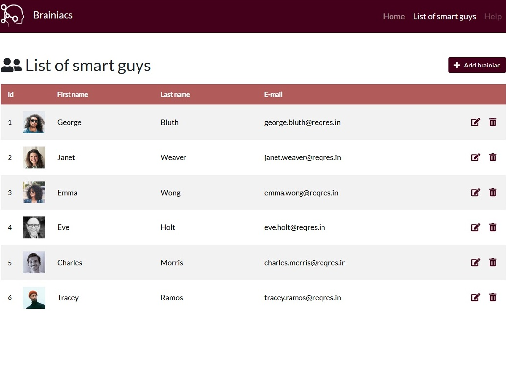

# 👋 Hi, my name is Grzegorz Łoś

 I’m a passionate frontend developer with a 5-year background in industrial automation, primarily focused on SCADA systems and PLC programming. Over the years, I’ve honed my analytical skills, problem-solving abilities, and attention to creating user-friendly systems. Currently, I’m enhancing my skills in web technologies, focusing on React, Next.js, Node.js, and modern frontend frameworks. I’m passionate about applying the lessons I’ve learned from automation to web development, especially when it comes to crafting intuitive and efficient user interfaces.

## 🤝 Community Engagement 
I'm an active participant in GDG Toruń (Google Developer Group), attending tech talks, workshops, and networking events. I believe that being part of a community is essential for growth, and I enjoy connecting with other developers to exchange knowledge and insights.

## 🚀 What Drives Me 
I thrive on constant learning and love turning ideas into interactive applications. My background in automation helps me approach problems with a structured mindset, while my passion for UI/UX pushes me to create applications that are both functional and user-friendly.

## 🔍 What I'm Looking For 
I'm seeking my first professional opportunity in IT, where I can leverage my engineering expertise, grow as a developer, and contribute to team projects in a collaborative environment.

## 💻 Projects 
I'm currently working on:

- A Next.js project as part of a small team, which allows me to gain practical experience in collaborative coding and Git workflow
- My own portfolio website, showcasing interactive projects with a focus on user experience

## You can check out my projects here:

| [Portfolio](https://github.com/Inen89/portfolio)  | [Smart Guys App](https://github.com/Inen89/smart-guys-app)                   |
|------------------------------------|----------------------------------|
|  |  |

## 🛠️ Tech Stack:
- **Frontend**:  
 	      
- **Backend**: 
   	  	
- **Automation**: 
    

- **Other**: 
  	

## ✉️ Contact: 

> "We cannot afford prudence. Prudence is a weakness that will doom us to perish in the shadows of history." 
> —  Badeni, *Chikyuu no Undou ni Tsuite*

